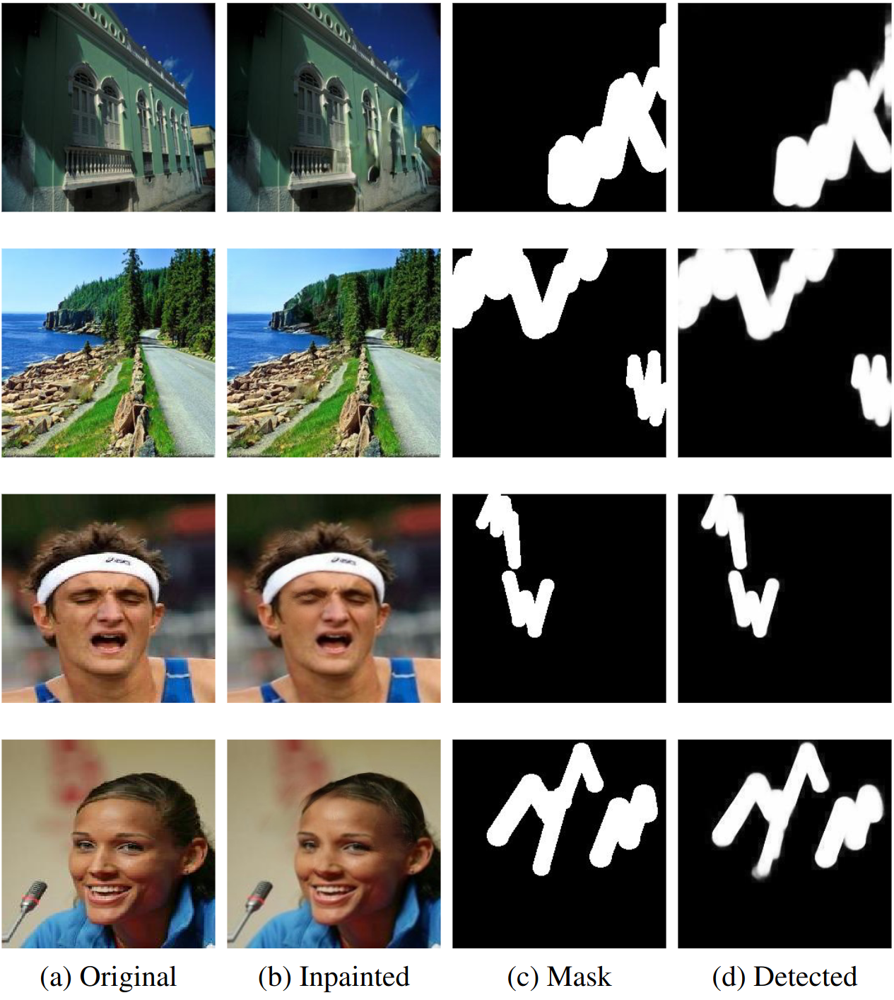

**IRL-Net: Inpainted Region Localization Network via Spatial Attention**
=======================================================================
The source code of the IRL-Net paper would be placed here after publishing of this paper by the journal.

**Introduction**
------------------------------------------------------------------------------------------------
Identifying manipulated regions in images is a challenging task due to the existence of very accurate image inpainting techniques leaving almost unnoticeable traces in tampered regions. These image inpainting methods can be used for multiple purposes (e.g., removing objects, reconstructing corrupted areas, eliminating various types of distortion, etc.) makes creating forensic detectors for image manipulation an extremely difficult and time-consuming procedure. The aim of this paper is to localize the tampered regions manipulated by  image inpainting methods.  To do this, we propose a novel CNN-based deep learning model called IRL-Net which includes three main modules: Enhancement, Encoder, and Decoder modules. To evaluate our method, three image inpainting methods have been used to reconstruct the missed regions in two face and scene image datasets. We perform both qualitative and quantitative evaluations on the generated datasets. Experimental results demonstrate that our method outperforms previous learning-based manipulated region detection methods and generates realistic and semantically plausible images.



Prerequisites
---------------------------------
* Python 3.7
* Tensorflow 2.0
* NVIDIA GPU + CUDA cuDNN

Installation
---------------------------------
* Clone this repo:
```
git clone https://github.com/amiretefaghi/IRL-Net
cd IRL-Net-master/Implementation
```
* Install Tensorflow

Dataset
---------------------------------
We prepared the training and test data by exploiting [Places2](http://places2.csail.mit.edu/download.html) and [CelebA](https://mmlab.ie.cuhk.edu.hk/projects/CelebA.html) datasets. We used three different deep inpainting approaches, approaches including [GC](https://ieeexplore.ieee.org/stamp/stamp.jsp?arnumber=9010689), [CA](https://openaccess.thecvf.com/content_cvpr_2018/papers/Yu_Generative_Image_Inpainting_CVPR_2018_paper.pdf), and [EC](https://arxiv.org/abs/1901.00212) to generate inpainted images on the two mentioned datasets. For each of the two mentioned datasets, we randomly selected (without replacement) 50K and 10K images to create training and test subsets, respectively. For inpainting images, mask generation is an important factor. To simulate more diverse and complex real-world scenarios, we utilize the irregular mask setting in [GC](https://ieeexplore.ieee.org/stamp/stamp.jsp?arnumber=9010689) with arbitrary shapes and random locations for both training and testing. Hence, our generated [datasets](https://drive.google.com/drive/folders/1JDSlTmPV38Zk5uiPutJ6SX8o_Z5lCwBk?usp=sharing) contain tuples of the inpainted image and generated mask.

Getting Started
--------------------------
To use the pre-trained models, download them from the following links then copy them to corresponding checkpoints folder.


### 0.Quick Testing
To hold a quick-testing of our inpaint model, download our pre-trained models of CelebA-HQ and put them into `./example`, then run:
```
python test.py --test_images_path "../datasets/GC_Places/test/inpainted/" --test_masks_path "../datasets/GC_Places/test/mask/" --model_weights_path "./Weights/Places_GC.h5"
```
and check the results in `./example/results`.

### 1.Training 

```
python train.py --batch_size 4 \
                --train_images_path './train/inpainted \
                --train_masks_path './train/mask \
                --val_images_path './val/inpainted \
                --val_masks_path './val/mask 
``` 


